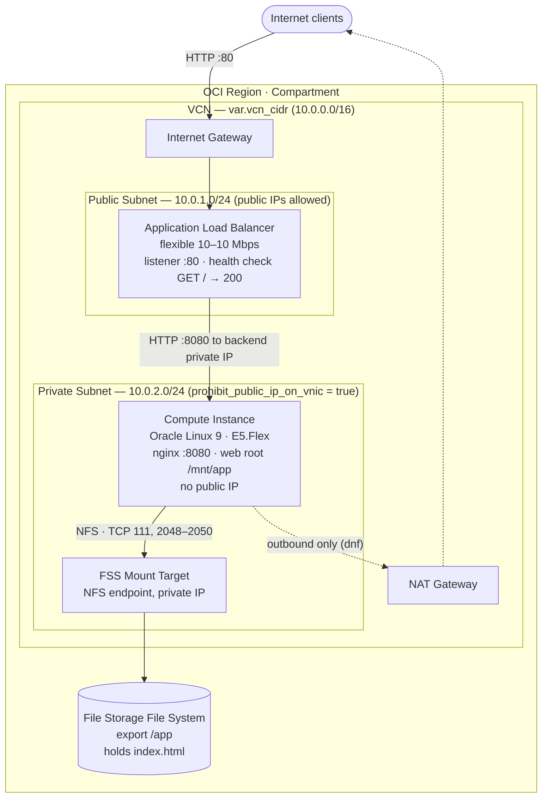

# OCI Terraform — Week 2 Lab

A two-tier lab environment in Oracle Cloud Infrastructure, built entirely with Terraform:

- one **VCN** with a **public subnet** and a **private subnet**
- an **Application Load Balancer** in the public subnet — the only thing on the internet
- a **compute instance** in the private subnet with **no public IP**, running nginx
- the application's files living on **OCI File Storage**, mounted over NFS

Traffic goes internet → load balancer → private instance → file read from the NFS export. The instance can reach out through a NAT gateway to install packages, but nothing can reach in.

One `terraform apply` builds it, one `terraform destroy` removes it.

## Lab requirements, and where each one is met

| # | Requirement | Where |
|---|-------------|-------|
| 1 | 1 VCN with 2 subnets | [network.tf](network.tf) — `oci_core_vcn.this`, `oci_core_subnet.public`, `oci_core_subnet.private` |
| 1a | Public subnet contains an Application Load Balancer | [loadbalancer.tf](loadbalancer.tf) — `oci_load_balancer_load_balancer.this`, `subnet_ids = [public]` |
| 1b | Private subnet contains a private compute instance | [compute.tf](compute.tf) — `oci_core_instance.app`, `assign_public_ip = false` |
| 2 | The private instance runs an application | [templates/cloud-init.sh.tftpl](templates/cloud-init.sh.tftpl) — nginx on `var.app_port`, installed and started at first boot |
| 3 | Application files stored on File Storage, mounted to the instance | [fss.tf](fss.tf) + the mount step in cloud-init — nginx's web root **is** the NFS mount |
| 4a | Avoid static/hardcoded argument values | Every CIDR, port, shape, name and size is a variable; see [variables.tf](variables.tf) |
| 4b | Use variables and locals as much as possible | [variables.tf](variables.tf) (43 variables), [locals.tf](locals.tf) (names, protocol numbers, NFS port ranges, derived AD/image/IP) |
| 4c | Separate code into multiple .tf files | 8 files, one concern each — see [File layout](#file-layout) |
| 4d | Use .tfvars for variable values | [terraform.tfvars.example](terraform.tfvars.example) → your gitignored `terraform.tfvars` |

## Architecture



The editable source is [docs/week2-architecture.drawio](docs/week2-architecture.drawio) — open it at [app.diagrams.net](https://app.diagrams.net) (File → Open From → Device) and export a PNG for the submission.

> The `.drawio` uses plain shapes so it renders anywhere. To swap in the official OCI stencils, open it in draw.io and use **More Shapes → Networking → Oracle Cloud Infrastructure**, then replace each box with its OCI equivalent — the layout and connections stay as they are.

### Why the pieces are arranged this way

**The private subnet is genuinely private.** `prohibit_public_ip_on_vnic = true` means OCI refuses to attach a public IP to any VNIC in it. The instance cannot be exposed by accident, even by a later mistake.

**So the instance still needs a way out.** `dnf install nginx nfs-utils` has to reach Oracle's package repositories. That's the NAT gateway: outbound-only, initiated from inside. The private route table sends `0.0.0.0/0` there, while the public route table sends it to the internet gateway.

**The load balancer bridges the two.** It holds the public IP in the public subnet and forwards to the instance's *private* IP. The listener is on 80 and the backend on 8080, so the config demonstrates port translation rather than hiding it.

**The security lists mirror that split.** The public list allows `var.lb_listener_port` in from `var.lb_allowed_cidrs`. The private list allows the app port in *only from the public subnet CIDR*, plus the NFS ports within the private subnet, plus SSH from inside the VCN. Nothing else.

**File Storage sits behind the mount target.** The file system is the storage, the mount target is the NFS endpoint that gets a private IP in the private subnet, and the export joins them at path `/app` with `source = var.private_subnet_cidr`. Only the private subnet can mount it.

**The app's web root is the mount.** nginx serves `/mnt/app` directly, so requirement 3 isn't decorative — destroy the instance, apply again, and the same `index.html` is still there because it never lived on the boot volume.

## File layout

```
week2/
├── provider.tf                    # Terraform + OCI provider, profile and region
├── variables.tf                   # every input, with descriptions and validation
├── locals.tf                      # names, constants, derived values, rendered cloud-init
├── data.tf                        # AD lookup, newest OL9 image, mount target IP
├── network.tf                     # VCN, IGW, NAT, 2 route tables, 2 security lists, 2 subnets
├── compute.tf                     # the private application instance
├── fss.tf                         # file system, mount target, export
├── loadbalancer.tf                # load balancer, backend set, backend, listener
├── outputs.tf                     # public IP, app URL, private IPs, OCIDs
├── templates/
│   └── cloud-init.sh.tftpl        # first-boot script: mount NFS, seed files, start nginx
├── docs/
│   ├── week2-architecture.drawio  # editable diagram
│   └── screenshots/               # Console screenshots for the deliverable
├── terraform.tfvars.example       # template — committed
├── terraform.tfvars               # your real values — gitignored
└── .terraform.lock.hcl            # locked provider versions — committed
```

The `.gitignore` lives at the [repository root](../README.md) and covers every week.

---

## Step 1 — Console exploration

Build it by hand first. The point isn't the clicking, it's seeing which fields each resource demands and which other resource it needs to exist first. **Then delete everything** before moving to Terraform, so week 2 doesn't collide with itself.

Work in this order — it's the dependency order Terraform figures out on its own:

1. **VCN** — *Networking → Virtual Cloud Networks → Create VCN*. CIDR `10.0.0.0/16`. Create it on its own, not with the wizard, so you see each following piece separately.
2. **Internet Gateway** — inside the VCN, *Internet Gateways → Create*.
3. **NAT Gateway** — *NAT Gateways → Create*. Note it offers no inbound configuration at all. That's the whole idea.
4. **Route tables** — one with `0.0.0.0/0 → Internet Gateway`, one with `0.0.0.0/0 → NAT Gateway`.
5. **Security lists** — one allowing TCP 80 from `0.0.0.0/0`, one allowing TCP 8080 from `10.0.1.0/24` plus TCP 111/2048-2050 and UDP 111/2048 from `10.0.2.0/24`.
6. **Subnets** — public `10.0.1.0/24` with the public route table, private `10.0.2.0/24` with the private route table and **"Prohibit public IP on VNIC"** ticked.
7. **Compute instance** — into the private subnet. The Console will grey out the public IP option, which is the confirmation the subnet is really private. Paste your SSH public key.
8. **File Storage** — *Storage → File Systems → Create*. Watch how the Console creates a **file system**, a **mount target** and an **export** as three separate things. Put the mount target in the private subnet. When it's done, the Console shows you the exact `mount` command — that's the one cloud-init runs in Step 2.
9. **Load Balancer** — *Networking → Load Balancers → Create*. This is the one worth the most attention:
   - shape **Flexible**, min/max 10 Mbps
   - **public** visibility, in the **public subnet**
   - backend set → add the instance as a backend on port **8080**
   - health check → HTTP, port 8080, URL path `/`
   - listener → HTTP on port **80**

   Then watch the backend sit at **unhealthy** until something is actually listening on 8080. That single detail explains most "the load balancer doesn't work" confusion.

10. **Destroy it all**, in reverse order: load balancer → instance → File Storage (export, then mount target, then file system) → subnets → security lists → route tables → gateways → VCN. OCI refuses to delete anything still referenced, which teaches the dependency graph a second time.

### What to take from Step 1 into Step 2

| Console field | Terraform argument |
|---|---|
| "Prohibit public IP on VNIC" | `prohibit_public_ip_on_vnic = true` |
| Mount target's "mount command" | the `mount -t nfs IP:/app /mnt/app` in cloud-init |
| Backend set → health check | `health_checker` inside `oci_load_balancer_backend_set` |
| Backend "IP address" | `oci_core_instance.app.private_ip` |
| Export "NFS export options → source" | `export_options.source` |

---

## Step 2 — Terraform implementation

### Prerequisites

The [root README](../README.md#shared-setup) covers the one-time setup: Terraform ≥ 1.3.0, an OCI account, `~/.oci/config` with a `DEFAULT` profile, and an SSH key pair. If you ran week 1, you're ready.

### Run it

```bash
cd week2
cp terraform.tfvars.example terraform.tfvars
# edit terraform.tfvars: compartment OCID + public key path

terraform init
terraform fmt -check
terraform validate
terraform plan
terraform apply
```

Expect **17 resources** — 9 networking, 1 instance, 3 File Storage, 4 load balancer. The apply takes about 5–8 minutes, most of it the load balancer and the mount target.

### Then wait for the backend to go healthy

`terraform apply` returns as soon as OCI has *created* the instance — not when cloud-init has finished installing nginx inside it. For the first two or three minutes the load balancer backend is legitimately **unhealthy** and the URL returns a 502.

```bash
terraform output application_url
# http://<lb-public-ip>:80/

# poll until it answers
curl -i "$(terraform output -raw application_url)"
```

Check progress in the Console under *Load Balancer → Backend Sets → your backend set → Backends*. Once it flips to **OK**, the page loads.

### Verify each requirement

```bash
# 1. one VCN, two subnets
terraform output vcn_id public_subnet_id private_subnet_id

# 2. the instance has a private IP and no public one
terraform output instance_private_ip
#    (there is deliberately no instance_public_ip output — it doesn't have one)

# 3. the app answers through the load balancer
curl "$(terraform output -raw application_url)"

# 4. the files really are on File Storage
terraform output mount_target_ip file_system_id nfs_mount_command
```

The strongest single proof for requirement 3: `terraform destroy -target=oci_core_instance.app` then `terraform apply`. The new instance re-mounts the same export, finds `index.html` already there, and skips the seeding step — the content survived the VM.

To look inside the instance, it has no public IP by design, so go through OCI Cloud Shell or a bastion in the public subnet:

```bash
ssh -i <your-private-key> opc@<private-ip>
df -h /mnt/app                       # shows the NFS mount
cat /etc/fstab | grep /mnt/app       # persists across reboot
sudo tail -50 /var/log/cloud-init-output.log
curl localhost:8080/healthz          # -> ok
```

### Screenshots for the deliverable

The checklist lives in [docs/screenshots/README.md](docs/screenshots/README.md) — nine Console views that together prove every requirement. Save the images into that folder and they'll render in the submission.

---

## Variables

All 43 inputs are declared in [variables.tf](variables.tf) with descriptions and, where it helps, validation rules. The ones you'll actually touch:

| Variable | Default | Notes |
|---|---|---|
| `compartment_id` | *(required)* | No default on purpose — it's tenancy-specific |
| `ssh_public_key_path` | `C:/salem-oci/ssh-key-2026-08-07.key.pub` | Path to the **public** key |
| `lab_name` | `salem-lab-w2` | Prefix for every display name |
| `oci_region` | `me-jeddah-1` | |
| `vcn_cidr` | `10.0.0.0/16` | |
| `public_subnet_cidr` | `10.0.1.0/24` | Load balancer lives here |
| `private_subnet_cidr` | `10.0.2.0/24` | Instance + mount target live here |
| `lb_allowed_cidrs` | `["0.0.0.0/0"]` | Narrow to `<your.ip>/32` for anything long-lived |
| `app_port` | `8080` | What nginx listens on |
| `lb_listener_port` | `80` | What clients connect to |
| `app_mount_point` | `/mnt/app` | Local mount path **and** the nginx web root |
| `fss_export_path` | `/app` | NFS-side export path |
| `instance_shape` | `VM.Standard.E5.Flex` | |
| `instance_ocpus` / `instance_memory_gb` | `1` / `12` | |
| `availability_domain_index` | `0` | Bump on "Out of host capacity" |

Everything else — health check timings, backend policy, LB bandwidth, identity squash, boot volume size, image OS and version — is a variable too, with a working default.

### The locals

[locals.tf](locals.tf) holds what shouldn't be repeated or retyped:

- `names` — every display name, derived from `lab_name`
- `protocol` — `tcp = "6"`, `udp = "17"`, so the security rules read as words instead of numbers
- `nfs_tcp_port_ranges` / `nfs_udp_port_ranges` — the FSS port list, fed to `dynamic` blocks
- `ssh_allowed_cidrs` — falls back to `var.vcn_cidr` when the variable is empty, rather than hardcoding a range
- `availability_domain`, `instance_image_id`, `mount_target_ip`, `load_balancer_ip` — resolved from data sources
- `cloud_init` — the rendered first-boot script

### `terraform.tfvars`

Real values go in `terraform.tfvars`, which is gitignored. `terraform.tfvars.example` is the committed template — the `*.tfvars` ignore rule doesn't match it, because the filename ends in `.example`.

---

## How the application boots

[templates/cloud-init.sh.tftpl](templates/cloud-init.sh.tftpl) runs once on first boot, rendered by `templatefile()` with the mount target IP, export path, mount point, port and app name:

1. `dnf install -y nfs-utils nginx` — outbound through the NAT gateway
2. adds the export to `/etc/fstab` with `nofail,_netdev` so a slow mount target can't block boot, then mounts it, **retrying for up to 5 minutes** because the mount target sometimes isn't answering the instant Terraform reports it created
3. asserts the mount actually succeeded, so a failure shows up in the log instead of silently serving an empty directory off the boot volume
4. seeds `index.html` onto the export **only if it isn't already there** — the file system outlives the instance
5. `setsebool -P httpd_use_nfs 1`, because SELinux otherwise blocks nginx from reading NFS-backed content
6. writes an nginx server block on `var.app_port` with the mount as its root, opens that port in firewalld, and starts nginx

Two syntax details worth knowing if you edit that file: it's a Terraform template *before* it's a shell script, so shell variables are written unbraced (`$VAR`, never `${VAR}`) to keep Terraform's hands off them, and the nginx block uses a quoted heredoc so nginx's own `$uri` survives.

If something goes wrong, everything lands in `/var/log/cloud-init-output.log` on the instance.

---

## Rough edges

- The load balancer accepts traffic from `0.0.0.0/0`. Fine for a lab, narrow `lb_allowed_cidrs` for anything longer.
- HTTP only. No certificate, no HTTPS listener, no redirect.
- One backend, so the load balancer isn't actually balancing anything. Making it two would mean a `count` on the instance and a matching `oci_load_balancer_backend` — a natural extension.
- There's no bastion, so reaching the instance means Cloud Shell or building one yourself. The SSH ingress rule is already open to the VCN for exactly that.
- `VM.Standard.E5.Flex` and the flexible load balancer are both **paid**. Run `terraform destroy` when you're finished.
- The instance reaches Oracle's package repos over the NAT gateway. A Service Gateway would keep that traffic on Oracle's network instead — worth adding if you want to explore it.

## Troubleshooting

| Symptom | Cause |
|---|---|
| `NotAuthenticated` / `401` | `~/.oci/config` missing, wrong fingerprint, or bad `key_file` path |
| `NotAuthorizedOrNotFound` | Wrong `compartment_id`, or no IAM policy in that compartment |
| `Out of host capacity` | Bump `availability_domain_index` to 1 or 2, or change the shape |
| `Invalid function argument` on `file(...)` | `ssh_public_key_path` is wrong. Use forward slashes on Windows |
| LB returns 502, backend "unhealthy" | Usually just cloud-init still running — give it 3 minutes. If it persists, SSH in and read `/var/log/cloud-init-output.log` |
| Backend unhealthy, nginx running | The app port isn't open. Check the private security list ingress from `public_subnet_cidr`, and `firewall-cmd --list-ports` on the instance |
| `mount.nfs: Connection timed out` in cloud-init | NFS ports missing from the private security list, or the mount target ended up in the wrong subnet |
| nginx 403 on every request | SELinux — confirm `getsebool httpd_use_nfs` returns `on` |
| Page loads but is the nginx default | The mount failed and nginx fell back to its stock server block on port 80. Check `df -h /mnt/app` |
| `terraform plan` shows resources you thought you destroyed | You're in the wrong week's folder — state is per-directory |

## Cleanup

```bash
terraform destroy
```

Deletes everything including the file system, so the seeded `index.html` goes with it. To keep the content, detach it first with `terraform state rm oci_file_storage_file_system.app` and delete it by hand later.

---

## Status

`terraform init`, `terraform fmt` and `terraform validate` all pass against OCI provider v7.32.0, and the cloud-init template has been rendered and syntax-checked. **It has not yet been applied against a live tenancy** — do that yourself and capture the screenshots, since the deliverable asks for Console evidence of resources Terraform actually created.
